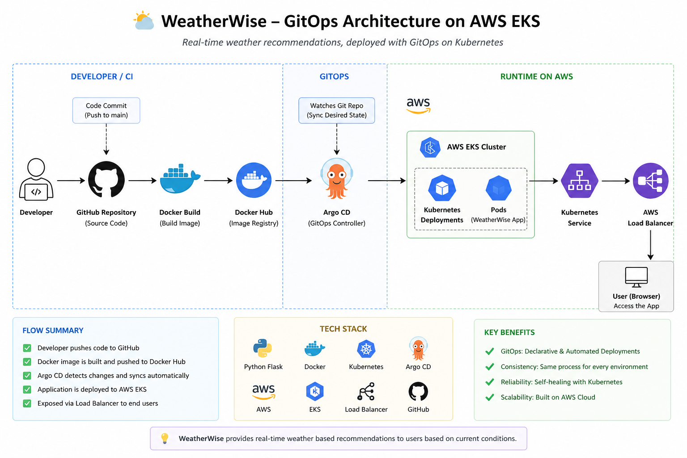
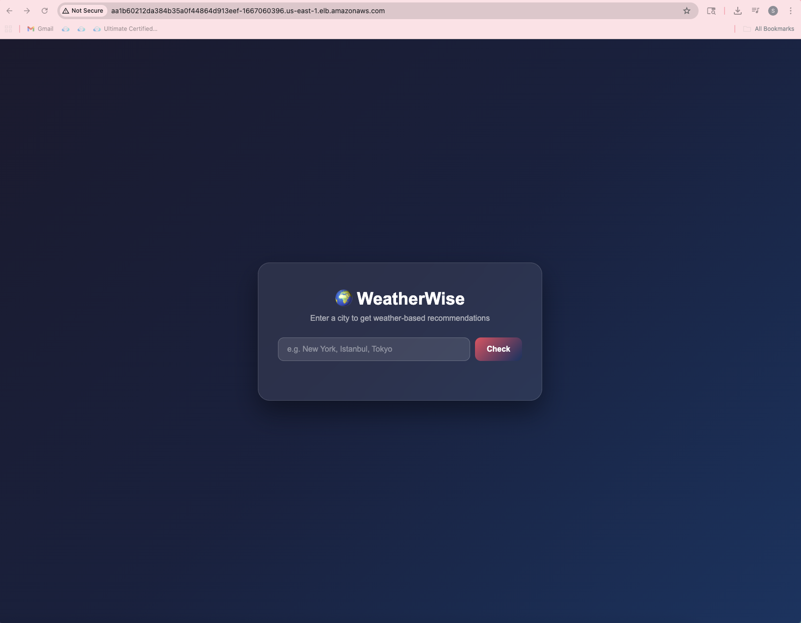
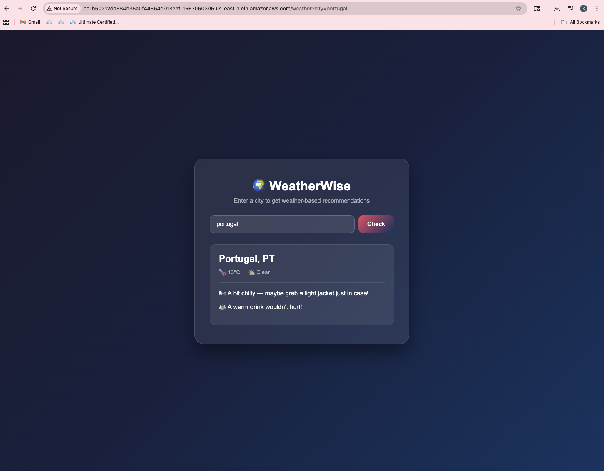

# 🌍 WeatherWise

A cloud-native weather recommendation app built with Python, containerized using Docker, and deployed on AWS EKS using a GitOps workflow powered by Argo CD.

🔗 **Live Demo:** http://aa1b60212da384b35a0f44864d913eef-1667060396.us-east-1.elb.amazonaws.com

---

## 🚀 Overview

WeatherWise is a simple yet production-style application that demonstrates how modern DevOps practices enable automated, scalable, and reliable application delivery.

Users can enter any city and receive personalized recommendations based on real-time weather conditions.

---

## 💡 What It Does

- ☂️ Rainy → Take an umbrella + Rainy Day Playlist  
- ☀️ Hot & Sunny → Apply sunscreen, stay hydrated  
- ⚡ Thunderstorm → Stay home + Must-watch films  
- ❄️ Snowy → Stay warm + Cozy playlist  
- 😎 Clear weather → Go outside and enjoy the day  

---

## 🎯 Why This Project?

This project simulates a real-world cloud-native deployment workflow and demonstrates:

- GitOps-based continuous deployment
- Infrastructure and application separation
- Automated Kubernetes deployments via Argo CD
- Scalable and reproducible environments on AWS

It reflects how production systems are built and managed in modern DevOps teams.

---

## 🧱 Tech Stack

- **Python (Flask)** — backend web application  
- **OpenWeatherMap API** — real-time weather data  
- **Docker** — containerization  
- **Kubernetes (AWS EKS)** — container orchestration  
- **Argo CD** — GitOps continuous deployment  
- **AWS Elastic Load Balancer (ELB)** — external access  

---

## 🏗️ Architecture

End-to-end deployment workflow:

1. Developer pushes code to GitHub  
2. Docker image is built and pushed to Docker Hub  
3. Kubernetes manifests are updated  
4. Argo CD detects Git changes automatically  
5. Argo CD syncs and deploys to EKS cluster  
6. AWS LoadBalancer exposes the application  

### WeatherWise – GitOps-Based Architecture on AWS EKS



---

## 📸 Screenshots

### Home


### Result


---

## ✨ Key Features

- GitOps-based deployment using Argo CD  
- Fully containerized application  
- Declarative Kubernetes manifests  
- Scalable cloud deployment on AWS EKS  
- Automatic synchronization between Git and cluster  

---

## 🔐 Security Considerations

- API keys are managed using Kubernetes Secrets  
- No sensitive data is stored in the repository  
- Infrastructure is defined as code for consistency and auditability  
- Separation of application and infrastructure layers  

---

## 📂 Repository Structure

```text
app/
├── main.py              # Flask application
└── requirements.txt     # Python dependencies

k8s/
├── deployment.yaml      # Kubernetes Deployment
├── service.yaml         # Kubernetes Service (LoadBalancer)
└── argocd-app.yaml      # Argo CD Application

diagrams/
└── weatherwise-architecture.png

screenshots/
├── weatherwise-home.png
└── weatherwise-result.png

Dockerfile               # Container build instructions
```

---

## 🖥️ Run Locally

```bash
docker build -t weatherwise .
docker run -p 5000:5000 weatherwise
```

Then open: http://localhost:5000

---

## ☸️ Deploy to Kubernetes

```bash
kubectl apply -f k8s/
```

Argo CD will handle continuous synchronization once configured.

---

## 🔄 CI/CD — Planned Improvements

- GitLab CI pipeline for automated builds and deployments
- Terraform validation and security scanning with tfsec and tflint
- Container image scanning with Trivy
- Automated promotion from dev to production

---

## 📊 Future Improvements

- Add Prometheus and Grafana for monitoring
- Implement centralized logging with Loki or ELK
- Introduce Helm for templating
- Add autoscaling with HPA
- Improve UI/UX

---

## 🧠 Key Takeaways

This project demonstrates:

- End-to-end DevOps workflow
- GitOps deployment strategy
- Kubernetes-based application management
- Cloud-native architecture on AWS

---

## 👤 Author

**Gulsah Ihtiyar**  
DevOps / Cloud Engineer  
CKA Certified | Terraform Associate